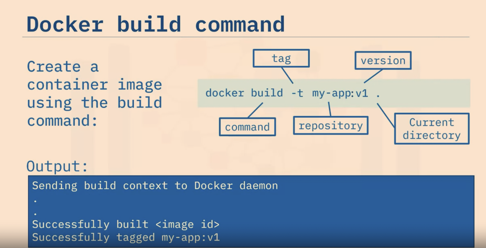

# Week 1 - Course Notes: Containers and Kubernetes

## Instructors:
- Alex Parker
- Upkar Lidder

## Course Overview:
- **Target Audience:** Anyone interested in designing, developing, deploying, and managing secure applications on public, private, and hybrid cloud platforms.
- **Objectives:** Learn the fundamentals of Containers, Docker, Kubernetes, and related cloud-native technologies.

## Module 1: Introduction to Containers and Kubernetes

### Containerization Background:
- Containers and Kubernetes designed for modern cloud-native development.
- Docker's release in 2013 boosted container technology's prominence.

### Industry Adoption:
- Gartner predicts over 70% of global organizations running more than two containerized applications by 2023.
- CNCF's 2019 survey: 84% of respondents use containers in production, up from 74% in 2018.

## Module 2: Kubernetes - The Orchestrator

### Kubernetes Overview:
- Open-source platform developed by Google in 2015.
- Surging interest: CNCF's 2019 survey shows a 20% increase in respondents interested in cloud-native computing technologies.

### GitHub Metrics:
- Third-largest platform for committers.
- Second-largest for issues and pull requests, following the Linux Kernel.

### Ecosystem:
- Thriving ecosystem around Kubernetes.
- Includes applications for cloud security, service mesh, and other cloud-native technologies.

## Module 3: Course Structure and Learning Path

### Foundations:
- Introduction to Containers, Docker, and container registries.

### Container Orchestration in Kubernetes:
- Understanding Kubernetes architecture.
- Deploying different resources in Kubernetes.
- Assembling components to deploy a functional application.

### Kubernetes Ecosystem:
- Exploration of tools like Red Hat OpenShift and Istio.
- Enhancing containerization journey and usage of containers.

## Module 4: Practical Labs

### Hands-on Labs:
- Practical exercises to reinforce theoretical knowledge.
- Application of concepts learned in the course.

### Environment:
- Free environment provided for labs if resources for setting up a Kubernetes cluster are unavailable.

## Module 5: Prerequisites and Getting Started

### Prerequisites:
- Basic computer and cloud literacy required.
- Understanding of core cloud concepts.
- Proficiency in the command line and shell commands highly beneficial.

## Conclusion:
- **Kubernetes and Containers:**
  - Industry-changing revolution.
  - Foundation for cloud-native applications and cloud computing learning.

## Course Closing:
- Instructors encourage participants to embark on their learning journey.
- Reiteration: Let's get started!


# Introduction to Containers

## Video Overview
Welcome to the "Introduction to Containers" video. After watching this, you'll be able to:

- Identify traditional computing issues for software development.
- Define a container and describe its characteristics.
- List container benefits and challenges.
- Recognize popular container vendors.

## Cloud-Native Development
Cloud-native is the latest application development approach for scalable, dynamic, and hybrid cloud-friendly software. Container technology plays a crucial role in this approach.

## Analogy: Shipping Containers
Drawing an analogy with shipping containers, standardized sizes enhance shipping efficiency. Similarly, digital container technology ensures software portability, allowing applications to run on multiple platforms.

## Container Technology
- **Definition:** A container is a standard unit of software encapsulating application code, runtime, system tools, libraries, and settings.
- **Portability:** Move applications seamlessly across environments.
- **Efficiency:** Overcome traditional deployment challenges.
- **Foundation:** Serves as the foundation for modern development and deployment solutions.

## Challenges with Traditional Computing Environments
Traditional environments face various challenges, including:
- Lack of isolation and resource allocation.
- Underutilized or overutilized servers.
- Comprehensive provisioning and maintenance costs.
- Limited scalability and poor performance during peak workloads.

## Container Solutions
Containers help overcome challenges by:
- Virtualizing the operating system through container engines.
- Being lightweight, fast, isolated, portable, and secure.
- Supporting multiple platforms and programming languages.
- Enabling quick deployment, lower costs, and improved resource utilization.

## Challenges of Using Containers
Using containers has its challenges, including:
- Server security concerns.
- Management complexities with a large number of containers.
- Complex conversion of monolithic legacy applications.
- Difficulty in right-sizing containers for specific scenarios.

## Popular Container Vendors
Learn about some popular container vendors:
- **Docker:** A robust and widely used container platform.
- **Podman:** A daemon-less container engine, known for enhanced security.
- **LXC:** Preferred for data-intensive applications and operations.
- **Vagrant:** Offers high isolation levels on the running physical machine.

## Conclusion
In summary, organizations are adopting containers to overcome challenges in isolation, utilization, provisioning, and performance. Containers serve as a standard unit of software, providing benefits in terms of deployment time, costs, resource utilization, and support for next-gen applications. However, challenges exist in management, legacy migration, and right-sizing. Major container vendors include Docker, Podman, LXC, and Vagrant.


# Introduction to Docker

## Video Overview
Welcome to the "Introduction to Docker" video. After watching this, you'll be able to:

- Define what Docker is.
- Describe the Docker process and underlying technology.
- List the benefits of Docker containers.
- Identify the challenges of Docker containers.

## What is Docker?
Available since 2013, Docker is an open platform for developing, shipping, and running applications as containers. It simplifies architecture, provides massive scalability, and ensures portability across multiple platforms, environments, and locations.

## Docker Architecture
- **Isolation:** Docker isolates applications from infrastructure, including hardware, the operating system, and the container runtime.
- **Technology:** Written in the Go programming language, Docker utilizes Linux kernel features and namespaces to create isolated workspaces known as containers.
- **Namespace Usage:** Docker creates separate namespaces for each container, ensuring limited access within each namespace.

## Docker Innovations
Docker's methodology has inspired several innovations, including:
- **Complementary Tools:** Docker CLI, Docker Compose, Prometheus, and various plugins, including storage plugins.
- **Orchestration Technologies:** Docker Swarm or Kubernetes.
- **Development Methodologies:** Microservices and serverless.

## Benefits of Docker
- **Consistent Environments:** Docker provides stable application deployments with consistent and isolated environments.
- **Rapid Deployments:** Applications can be deployed in seconds.
- **Image Reusability:** Small and reusable Docker images accelerate the development process.
- **Automation Capabilities:** Docker automation helps eliminate errors, simplifying the maintenance cycle.
- **Support for Agile and CI/CD DevOps Practices:** Docker facilitates easy versioning, testing, rollbacks, and redeployments.
- **Segmentation:** Docker helps segment applications for refresh, cleanup, and repair.
- **Portability:** Docker images are platform-independent, ensuring high portability.

## Challenges of Using Docker
Docker may not be suitable for applications with the following qualities:
- Require high performance or security.
- Based on monolithic architecture.
- Utilize rich GUI features.
- Perform standard desktop or limited functions.

## Conclusion
In summary, Docker is an open platform that revolutionizes application development, deployment, and running through containerization. It offers numerous benefits, such as consistent environments, rapid deployments, and automation support. However, it may not be the best fit for certain types of applications, such as those requiring high performance or following a monolithic architecture.


# Building and Running Containers

## Video Overview
Welcome to the "Building and Running Containers" video. After watching this, you'll be able to:

- Build a container image using a Dockerfile.
- Create a running container using an image.
- Describe key Docker commands.


## Development Process of a Running Container
This diagram illustrates the development process of a running container, involving the following steps:
1. Create a Dockerfile.
2. Use the Dockerfile to build a container image.
3. Use the container image to create a running container.

## Sample Dockerfile
A sample Dockerfile includes the commands:
- `FROM`: Defines the base image.
- `CMD`: Prints the words "Hello World!" on the terminal.

## Building a Container Image
To build the container image, use the following Docker command:
```bash
docker build -t my-app:v1 .
```




## Introduction to Docker Objects

### Video Overview
Welcome to the "Introduction to Docker Objects" video. After watching this, you'll be able to:

- Identify and describe Docker objects.
- Recognize essential Dockerfile commands.
- Explain the container image naming format.
- Describe how Docker utilizes networks, storage, and plugins.

### Docker Objects
Docker comprises various objects, including:
- Dockerfile
- Images
- Containers
- Networks
- Storage volumes
- Plugins and add-ons

### Dockerfile Essentials
A Dockerfile is a text file containing instructions to create an image. Essential Dockerfile commands include:
- **FROM:** Defines a base image, often from a public repository.
- **RUN:** Executes commands.
- **CMD:** Defines a default command for execution; a Dockerfile should have only one CMD instruction.

### Docker Images
A Docker Image is a read-only template with instructions for creating a container. Key points:
- Each Docker instruction creates a new layer in the image.
- Docker engine rebuilds only changed layers when the Dockerfile is modified.
- Images share layers to save disk space and network bandwidth.
- A writeable container layer is added when the image is instantiated.

## Image Naming Format
An image name consists of three parts:
- **Hostname:** Identifies the image registry (e.g., docker.io).
- **Repository:** Group of related container images (e.g., ubuntu).
- **Tag:** Specifies a version or variant of the image (e.g., 18.04).

### Docker Containers
A Docker container is a runnable instance of an image. Key aspects:
- Docker API or CLI is used to create, start, stop, or delete a container.
- Containers can connect to multiple networks, attach storage, or create a new image based on their current state.
- Docker ensures well-isolated containers from each other and the host machine.

### Networks and Storage
- **Networks:** Help isolate container communications.
- **Data Persistence:** Docker uses volumes and bind mounts to persist data even after a container stops running.
- **Plugins:** Storage plugins, among others, enable connectivity to external storage platforms.

### Conclusion
In summary, this video highlighted Docker objects, including Dockerfiles, images, containers, networks, and storage volumes. Essential Dockerfile commands such as FROM, RUN, and CMD were explained. A Docker container is a runnable instance of an image, with an image naming format comprising hostname, repository, and tag. Networks and storage mechanisms, including volumes and bind mounts, contribute to container isolation and data persistence. Plugins, such as storage plugins, extend Docker's capabilities to connect to external storage platforms.


# Docker Architecture

### Video Overview
Hello, and welcome to "Docker Architecture." After watching this video, you'll be able to:

- Identify the components of the Docker architecture.
- Explain the features of Docker architecture components.
- Describe the process of containerization using Docker.

### Docker Components
The Docker client-server architecture comprises three main components:
- **Client:** Used to send instructions to the Docker host.
- **Host:** Contains the daemon (dockerd), which processes Docker API requests and commands.
- **Registry:** Stores and manages container images.

### How Docker Works
- Use Docker CLI or REST APIs to send instructions to the Docker host.
- The Docker host (with dockerd) does the heavy lifting of building, running, and distributing Docker containers.
- Docker stores container images in a registry.
- The Docker host manages various components, including images, containers, namespaces, networks, storage, plugins, and add-ons.

### Docker Client-Server Communication
- The Docker client communicates with local and remote Docker hosts.
- The client and daemon can run on the same system or connect remotely.
- Docker daemons can communicate with each other to manage Docker services.

### Docker Registry
- Docker stores and distributes images in a registry.
- Registries can be public (e.g., Docker Hub) or private.
- Private registries are often chosen by enterprises for security.
- Registries can be hosted by third-party providers or self-hosted.

### Moving Images into the Registry
1. Developers build and push images into the registry using automation or build pipelines.
2. Local machines, cloud systems, and on-premises systems can pull these images from the registry.

### Docker Architecture Visual Representation
- Docker architecture includes the client, Docker host (with daemon), and the registry with stored images.

### Containerization Process
Here's how Docker is used to create a container image:
1. Use an existing base image or a Dockerfile.
2. Issue the build command to create a container image with a name.
3. Use the push command to store the image in the registry.
4. The host checks locally for the image and issues the run command to create a container.
5. If the image is not local, the Docker client pulls it from the registry, and the daemon creates a running container.

### Conclusion
In summary, you learned that Docker architecture consists of a client, host, and registry. The client interacts with the host using commands and REST APIs. The Docker host includes the daemon (dockerd) and manages various components. Containerization is the process of building, pushing, and running an image to create a running container.


# Summary of Key Points on Containers and Docker

### Containers
- A container is a unit of software that encapsulates everything needed to build, ship, and run applications.
- Containers contribute to lower deployment time and costs, improved resource utilization, process automation, and support for next-gen applications, including microservices.
- Major container vendors include Docker, Podman, LXC, and Vagrant.

### Docker Overview
- Docker is an open platform used for developing, shipping, and running applications as containers.
- Docker containers are not suitable for applications based on monolithic architecture or those requiring high performance or security.

### Docker Architecture
- Docker architecture consists of three main components: the Docker client, the Docker host, and the container registry.
- The Docker host contains various objects, including Dockerfiles, images, containers, networks, storage volumes, plugins, and add-ons.

### Networking and Storage in Docker
- Docker uses networks to isolate container communications, ensuring secure and efficient interactions.
- To persist data even after a container stops running, Docker employs volumes and bind mounts.
- Plugins, such as storage plugins, enhance Docker's capabilities by allowing connectivity to external storage platforms.

These key points provide a comprehensive overview of containers, Docker, and its architecture, emphasizing the benefits, limitations, and essential components in the containerization process.


#Week 2

Container Orchestration

# Container Orchestration Overview

### Video Summary
Welcome to "Container Orchestration." After this video, you'll be able to:
- Define the challenges of container management.
- Determine when container orchestration is needed.
- Demonstrate container orchestration benefits.

### Challenges of Container Management
- As your container journey progresses, managing a growing number of containers becomes overwhelming.
- Connecting, managing, and scaling hundreds or thousands of containers in large applications can be challenging.

### When Container Orchestration is Needed
- Container orchestration is essential for handling large numbers of containers efficiently.
- It automates the container lifecycle, including deployment, management, scaling, networking, and availability.
- Particularly necessary in large, dynamic environments, container orchestration streamlines complexity, enables hands-off deployment and scaling, and integrates seamlessly into CI/CD workflows.

### Benefits of Container Orchestration
- Increases speed, agility, and efficiency in managing containers.
- Supports on-premises, public, private, or multi-cloud environments.
- Addresses security, orchestration, automation, and response (SOAR) requirements.
- Offers features such as defining container images, automated provisioning, securing network connections, ensuring availability, scaling, resource allocation, rolling updates, rollbacks, and health checks.

### Container Orchestration Tools
1. **Marathon:** Framework for Apache Mesos, automates management and monitoring tasks.
2. **Nomad (HashiCorp):** Free, open-source cluster management tool supporting various workload types.
3. **Docker Swarm:** Automates deployment, designed to work with Docker tools.
4. **Kubernetes:** Open-source platform, de facto standard for container orchestration, automates deployment, storage provisioning, load balancing, scaling, service discovery, and self-healing.

### Using Configuration Files
- Container orchestration uses configuration files (YAML or JSON) to configure containers, schedule deployments, and manage container lifecycles.
- Automatically schedules deployment based on predefined settings or restrictions.

### Benefits of Container Orchestration
- **Increased Productivity:** Removes the burden of manual container management, reducing errors and allowing focus on application improvement.
- **Faster Deployments:** Enables rapid releases of new features and capabilities.
- **Reduced Costs:** Cost-effective with lower overhead compared to virtual machines.
- **Stronger Security:** Improves overall container security through resource sharing and process isolation.
- **Easier Scalability:** Allows scaling applications with a single command.
- **Faster Error Recovery:** Maintains high availability by detecting and resolving issues automatically.

### Conclusion
In this video, you learned that managing large numbers of containers is challenging. Container orchestration automates the container lifecycle, resulting in faster deployments, reduced errors, higher availability, and stronger security. Popular container orchestration tools include Marathon, Nomad, Docker Swarm, and Kubernetes. Container orchestration improves productivity, deployments, costs, security, scalability, and error recovery.


# Introduction to Kubernetes

## Video Summary

Welcome to "Introduction to Kubernetes." After this video, you'll be able to:
- Define Kubernetes
- Explain what Kubernetes is not
- Relate Kubernetes concepts
- Describe Kubernetes capabilities
- Understand the Kubernetes ecosystem

## What is Kubernetes?
Kubernetes is an open-source system for automating deployment, scaling, and management of containerized applications. It is developed by Google and maintained by the Cloud Native Computing Foundation. Kubernetes is highly portable, supporting both cloud and on-premises environments, and is recognized as the go-to container orchestration solution.

### What Kubernetes is NOT
- Not a traditional, all-inclusive platform as a service.
- Not rigid or opinionated, but rather a flexible model supporting diverse workloads.
- Not providing continuous integration/delivery pipelines, logging, monitoring, or built-in middleware, databases, or services.

## Kubernetes Concepts
Key Kubernetes concepts include:
- **Pods:** Smallest deployable compute object, higher-level abstractions for workloads.
- **Services:** Expose applications running on sets of Pods.
- **Configuration:** Provisioning resources for configuring Pods.
- **Security Measures:** Enforce security for Pod and API access.
- **Policies:** Groups of resources, ensuring matching to Nodes.
- **Scheduling and Eviction:** Proactive termination and scheduling of Pods.
- **Preemption:** Prioritization and termination of lower priority Pods.
- **Cluster Administration:** Details necessary to create or administer a cluster.

## Kubernetes Capabilities
- **Automated Rollouts:** Changes to application or configuration, health monitoring, and rollbacks.
- **Storage Orchestration:** Mounts chosen storage systems, including local, network, or public cloud.
- **Horizontal Scaling:** Scaling workloads based on metrics or commands.
- **Automated Bin Packing:** Increased utilization and cost savings.
- **Secret and Configuration Management:** Handles sensitive information.
- **IPv4/IPv6 Dual Stack Support:** Assigns both addresses to Pods and Services.
- **Batch Execution:** Manages batch and continuous integration workloads.
- **Self-Healing:** Replaces failed or unresponsive containers.
- **Service Discovery and Load Balancing:** Discovers Pods, load balances for performance and availability.
- **Designed for Extensibility:** Adds features to your cluster without modifying source code.

## Kubernetes Ecosystem
The Kubernetes ecosystem is vast and rapidly growing, including services, support, and tools. It requires additional tools for running containerized applications, and key categories in the ecosystem include:
- **Building Container Images**
- **Storing Images in a Container Registry**
- **Application Logging and Monitoring**
- **CI/CD Capabilities**

### Ecosystem Providers
- **Public Cloud Providers:** Prisma, IBM, Google, AWS.
- **Open Source Framework Providers:** Red Hat, VMWare, SUSE, Mesosphere, Docker, Cloud Foundry.
- **Management Providers:** Digital Ocean, Loodse, SUPERGIANT, CloudSoft, Turbonomic, Techtonic, Weaverworks.
- **Tool Providers:** Jfrog, Univa, Aspen Mesh, Bitnami, Cloud 66.
- **Monitoring & Logging Providers:** Sumo Logic, DATADOG, New Relic, Iguazio, Grafana SignalFX, Sysdig, Dynatrace.
- **Security Providers:** Guardcore, BlackDuck, Yubico, Cilium, Aqua, Twistlock, Alcide.
- **Load Balancing Providers:** AVI Networks, VMware, NGiNX.

## Conclusion
In this video, you learned that Kubernetes is a highly-portable, horizontally scalable, open-source container orchestration system. It automates deployment and simplifies management, supporting various workloads and environments. Kubernetes concepts include Pods, services, storage, security, policies, scheduling, eviction, preemption, and administration. Its capabilities cover automated rollouts, storage orchestration, horizontal scaling, bin packing, secret management, dual-stack support, batch execution, self-healing, service discovery, and extensibility. The Kubernetes ecosystem is extensive, with providers in various categories, making it a comprehensive solution for containerized applications.
